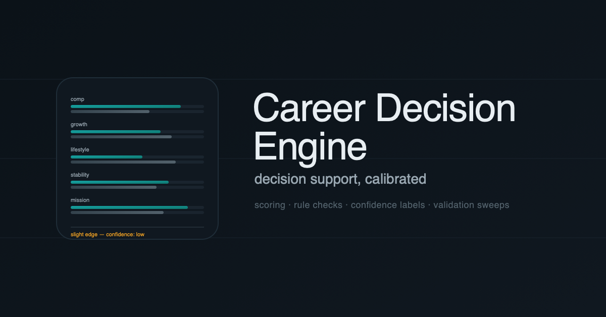

# Decision Engine



Decision Engine is a decision-support research repository for turning explicit inputs and policy into inspectable recommendations without hiding uncertainty or silently acquiring authority to act.

The repository currently contains a **maintained bounded Contract C 1.0.0 → explicit Decision policy → Contract D 1.0.0 surface with two explicit policies and an exact-authority invocation CLI**, plus two pre-existing decision heads with different scopes. They should not be collapsed into one maturity claim.

Pipeline siblings: [Claim Audit Lab](https://github.com/camerontjs-dot/claim-audit-lab), [Evidence Bundler](https://github.com/camerontjs-dot/evidence-bundler), and [Apparatus Contracts](https://github.com/camerontjs-dot/apparatus-contracts). The standalone career presentation lives in [`career-decision-engine`](https://github.com/camerontjs-dot/career-decision-engine).

## Current implemented surfaces

### 1. Bounded Contract C → Decision → Contract D surface

This is the claim-audit pipeline path. [Apparatus Contracts](https://github.com/camerontjs-dot/apparatus-contracts) is the canonical Contract C and Contract D authority. Current upstream producers may emit Contract C into this boundary, but Decision Engine does not inspect CAL-private or Evidence Bundler-private state and does not compensate for an upstream object that fails Contract C.

The maintained Contract C ingress is [`src/contractCIngress.js`](src/contractCIngress.js). Before either policy can inspect Contract C semantics, it verifies:

- the caller-supplied whole-object SHA-256;
- the exact released Contract C 1.0.0 checkout, tag, and canonical validator identity;
- canonical Contract C validation;
- the exact expected Contract B binding.

Only after that common authority boundary succeeds does an explicit Decision policy evaluate an exact target.

#### Policy A: supported claim verification

[`src/contractCDecision.js`](src/contractCDecision.js) implements:

`decision-engine.contract-c.supported-claim-verification@1.0.0`

Its policy question is intentionally narrow:

> May this exact audited claim become a candidate for downstream Authorization of `knowledge.add_verified_tag@1(scope=claim)`?

For that policy only:

```text
result set completed
+ proposition completed:assessed
+ reported_verdict == supported
    -> Contract D completed / clear

any other valid Contract C epistemic state
    -> Contract D completed / hold

valid input + well-formed target context that identifies no proposition
    -> Contract D evaluation.failed
```

#### Policy B: causal-basis citation

[`src/contractCBasisCitationDecision.js`](src/contractCBasisCitationDecision.js) implements:

`decision-engine.contract-c.causal-basis-citation@1.0.0`

Its question is different:

> Does exact validated Contract C establish that this exact retained contribution is a causal-basis contribution for this exact completed assessed proposition?

The target is an exact `claim-evidence-link`. The effect is `knowledge.cite_as_evidence@1`.

For this policy, a causal-basis contribution can CLEAR; a retained residual/non-deciding contribution HOLDs; and an otherwise valid request that cannot identify the requested proposition or contribution yields `evaluation.failed`. The policy deliberately does not use headline `reported_verdict`, measurement thresholds, or assessment-stage values to manufacture citation authority.

A CLEAR here does **not** establish that the source is trustworthy, that the evidence is universally true, that a citation is complete/publication-ready, or that any actor is authorized to mutate knowledge state.

#### Common runtime and CLI

[`src/contractCDecisionRuntime.js`](src/contractCDecisionRuntime.js) provides an explicit two-case dispatch over those exact policy IDs and versions. It is not a policy registry or general rule engine.

[`src/contractDCanonicalOutput.js`](src/contractDCanonicalOutput.js) verifies the exact Contract D 1.0.0 release authority and uses the released Contract D validator/canonicalizer for output.

[`scripts/decision-engine-evaluate.mjs`](scripts/decision-engine-evaluate.mjs) is the thin invocation surface. It accepts exact Contract C/D authority roots, an external Contract C whole-object digest, exact expected Contract B binding, explicit policy identity, and policy-specific target context. Successful stdout is canonical Contract D only; invalid authority or context fails closed with no Decision bytes on stdout.

The CLI stops at Contract D. It does not perform requested-operation applicability, operational Authorization, actor selection, approval/delegation, or execution.

Malformed, wrong-version, wrong-whole-object, wrong-Contract-B, target-substituted, unsupported-policy, or wrong-Contract-D-authority input does not acquire stronger Decision authority.

For either policy, a Contract D `clear` Decision is **not Authorization**. Under exact Contract D applicability it can become only `candidate_for_authorization`.

The Contract C policy surface deliberately does **not** route through the pre-existing Gate head. Contract D 1.0.0 owns `clear | hold | evaluation.failed`; the existing Gate owns `promote | hold | reject`. The two maintained Contract C policies now demonstrate a shared exact ingress and invocation boundary, but they do not establish a universal policy vocabulary or generic policy framework.

See:

- [`docs/CONTRACT_C_TO_D_PRODUCTION_SLICE.md`](docs/CONTRACT_C_TO_D_PRODUCTION_SLICE.md) for the original supported-claim promotion boundary;
- [`docs/DECISION_POLICY_SURFACE.md`](docs/DECISION_POLICY_SURFACE.md) for the demonstrated two-policy surface and architecture comparison;
- [`docs/DECISION_ENGINE_EVALUATE_CLI.md`](docs/DECISION_ENGINE_EVALUATE_CLI.md) for the exact-authority invocation boundary.

### 2. Select / rank head: career comparison

The original application is a browser-based career comparison tool in [`src/decisionEngine.js`](src/decisionEngine.js), with the UI in [`index.html`](index.html) and [`src/app.js`](src/app.js).

It compares fictional job offers or career paths across explicit dimensions, weights, caveats, and confidence rules. The engine is deterministic and separate from the UI. Its tests cover scoring invariants, output quality, and a broad combination matrix.

This head is **domain-specific**. It is not evidence that the weighted career scorer is a general-purpose decision kernel.

A separate public repository, [`career-decision-engine`](https://github.com/camerontjs-dot/career-decision-engine), owns the standalone career-project presentation. This repository retains the implementation as a working baseline and regression surface while broader decision primitives are researched.


### 3. Gate head: one item against a stated bar

[`src/gate/gateHead.js`](src/gate/gateHead.js) implements a smaller reusable primitive for a different question:

> Does this one item clear this explicitly stated bar?

The Gate evaluates named criteria with three outcomes:

- `pass`
- `fail`
- `unknown`

The decision rule is deterministic:

```text
any blocking fail     -> reject
any blocking unknown  -> hold
otherwise             -> promote
```

`unknown` is deliberately distinct from `fail`. A missing or unobserved condition may hold a decision, but it does not manufacture an adverse finding.

The Gate does not use a combined score. It records which criteria passed, failed, or remained unknown, and advisory findings remain visible as caveats.

The implementation is pure: it performs no I/O and resolves no missing evidence. Callers supply observations. Positive outputs are recommendations, not mutations; the returned record carries `requiresHumanApproval` where the policy demands it and always records `appliedAutomatically: false`.

[`src/gate/notePromotionBar.js`](src/gate/notePromotionBar.js) is one concrete MainFrame note-promotion policy built on that primitive. It is an application of the Gate, not proof that its vocabulary is the final general Decision Engine policy model.

## Contract C and Contract D authority

**Contract C 1.0.0 and Contract D 1.0.0 are canonical and released by [`apparatus-contracts`](https://github.com/camerontjs-dot/apparatus-contracts).**

The maintained Decision surface is pinned to those exact released authorities. Cross-repository conformance and policy-specific workflows verify immutable release identities, canonical validators/consumers, external whole-object and target bindings, substitution controls, and the Decision/Authorization firewall.

Relevant records:

- [Contract C 1.0.0 release](https://github.com/camerontjs-dot/apparatus-contracts/releases/tag/contract-c-v1.0.0)
- [Contract D 1.0.0 release](https://github.com/camerontjs-dot/apparatus-contracts/releases/tag/contract-d-v1.0.0)
- [Decision Engine #29: original bounded supported-claim production promotion](https://github.com/camerontjs-dot/decision-engine/pull/29)
- [Decision Engine #35: contract-first policy #2 research record](https://github.com/camerontjs-dot/decision-engine/pull/35)
- [Decision Engine #36: second policy and shared exact ingress promotion](https://github.com/camerontjs-dot/decision-engine/pull/36)
- [Decision Engine #38: exact-authority invocation library/CLI promotion](https://github.com/camerontjs-dot/decision-engine/pull/38)

The committed research records remain evidence, not production interfaces. They preserve the path by which maintained boundaries were tested and narrowed.

Synthetic valid Contract C fixtures used by Decision Engine establish downstream policy behavior only. They do not independently establish current CAL reachability, CAL semantic correctness, source legitimacy, or corpus completeness.

### Preserved upstream reachability limitation

The earlier real-producer research demonstrated at least one current-CAL semantic state that could not be exported through Contract C 1.0.0 because the corresponding rule attribution was not promoted.

That remains an **upstream production-reachability limitation**. Decision Engine does not inspect CAL-private state, reconstruct the missing result downstream, or widen Contract C interpretation. The maintained policies can therefore be verified against valid Contract C fixtures without claiming every valid state is currently emitted by CAL.

## Decision / Authorization boundary

Research and Contract D conformance support one bounded architecture decision:

**Decision and operational Authorization are separate interfaces.**

A Decision is an inspectable policy conclusion about an exact target. Authorization separately combines that Decision with actor, requested operation, approval/delegation context, and operational restrictions.

A generic `eligible` or `clear` disposition is not sufficient operational authority. The requested operation must bind to a typed Decision effect or equivalent policy-specific output. Execution remains downstream and should be recorded separately.

This boundary is preserved by Contract D 1.0.0 consumption: exact `clear` plus exact applicability establishes only `candidate_for_authorization`. See [the Decision / Authorization EDR](docs/DECISION_AUTHORIZATION_BOUNDARY.md).

## Run the current surfaces

### Contract C → Decision → Contract D conformance

The maintained contract-first boundary is exercised by GitHub Actions because it depends on exact released Apparatus checkouts and frozen external evidence/consumers:

- `.github/workflows/contract-c-to-d-1.0.0-conformance.yml` preserves the original supported-claim cross-repository controls;
- `.github/workflows/contract-first-two-policy-conformance.yml` exercises both maintained policies and cross-policy replay/substitution controls;
- `.github/workflows/contract-first-evaluate-cli-conformance.yml` exercises the exact-authority runtime and CLI and independently consumes emitted Contract D objects.

### Decision evaluate CLI

Conceptually:

```text
node scripts/decision-engine-evaluate.mjs \
  --contract-c <path> \
  --contract-c-sha256 <sha256:...> \
  --contract-c-authority <exact Contract C 1.0.0 checkout> \
  --contract-d-authority <exact Contract D 1.0.0 checkout> \
  --expected-contract-b <JSON path> \
  --policy <id@version> \
  --context <policy-specific JSON path>
```

See [`docs/DECISION_ENGINE_EVALUATE_CLI.md`](docs/DECISION_ENGINE_EVALUATE_CLI.md) for exact input shapes and failure behavior.

### Browser career head

Open:

```text
index.html
```

The browser test page is:

```text
tests/decisionEngine.test.html
```

### Node checks

```bash
node tests/engine.sweep.mjs
node tests/output-quality.sweep.mjs
node tests/combination-matrix.sweep.mjs
node --test tests/gateHead.test.mjs
```

### Contract C shadow fixture check

```bash
node research/contract-c-seam-shadow/validate-fixtures.mjs
```

## Repository map

```text
src/decisionEngine.js                         career select/rank engine
src/app.js                                    career browser UI
src/gate/gateHead.js                          generic named-criterion Gate primitive
src/gate/notePromotionBar.js                  MainFrame-specific Gate policy
src/contractCIngress.js                       exact Contract C authority/binding ingress
src/contractCDecision.js                      supported-claim verification policy
src/contractCBasisCitationDecision.js         causal-basis citation policy
src/contractCDecisionRuntime.js               explicit two-policy invocation dispatch
src/contractD.js                              Contract D wire-state exporter
src/contractDCanonicalOutput.js               exact Contract D validation/canonical output
scripts/decision-engine-evaluate.mjs           thin exact-authority CLI

tests/                                        career, Gate, Contract C→D, policy, CLI checks
research/contract-c-seam-shadow/              preserved Contract C / Gate research fixtures
docs/CONTRACT_C_TO_D_PRODUCTION_SLICE.md      original bounded policy/contract EDR
docs/DECISION_POLICY_SURFACE.md               two-policy maintained boundary
docs/DECISION_ENGINE_EVALUATE_CLI.md          exact-authority invocation surface
docs/DECISION_AUTHORIZATION_BOUNDARY.md       Decision / Authorization boundary EDR
docs/ENGINE_NOTES.md                          career engine formulas and behavior notes
```

## Boundaries

This repository does **not** currently establish that:

- the career select/rank engine is a general decision engine;
- `promote | hold | reject` is the correct universal action vocabulary;
- `supported` universally maps to `clear` outside `decision-engine.contract-c.supported-claim-verification@1.0.0`;
- causal-basis membership proves source trustworthiness, universal truth, corpus completeness, or citation completeness;
- every theoretically reachable CAL semantic state is production-reachable through Contract C 1.0.0;
- CAL conclusions directly authorize downstream action;
- Decision Engine implements actor authority, approval, delegation, Authorization, execution, or automatic mutation;
- synthetic or real-producer Contract C fixtures validate CAL semantic correctness;
- two policies justify a registry, DSL, plugin system, generic rule engine, or universal target abstraction.

The current useful separation is:

```text
validated canonical Contract C state
      ↓
explicit Decision Engine policy + exact target context
      ↓
canonical Contract D Decision
      ↓
separate future Authorization authority
      ↓
separate execution
```

## License

MIT.
